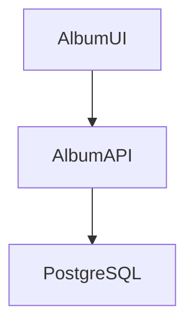

# Album API (Java)

Album UI と連携して利用するバックエンドのサービスです。



# ローカル環境
## ビルド

データベースサーバにはデフォルトでは h2 が利用されますが、Postgresql も利用可能です。
`spring.profiles.active=postgresql` とすることで、Postgresqlに接続するようになます。
`src/main/resources/applications.properties` を編集するか、実行時のオプションでプロファイルを切り替えてください。

```sh
mvn package
```

## 実行

h2 データベースを利用する場合：

```sh
mvn spring-boot:run
```

Postresql を利用する場合は、コンテナでPostgresqlを実行後、アプリケーションを起動します。
```
podman compose --file docker-compose.yaml up postgres
```

```
mvn -Ppostgresql spring-boot:run
or
export spring_profiles_active=postgresql
mvn spring-boot:run
```

## 動作確認

http://localhost:8080/albums にアクセスして、JSON形式で書籍の一覧が表示されることを確認します。


# ローカルコンテナ環境

## マルチステージビルド


```
podman build . -f docker/Dockerfile -v $HOME/.m2:/home/default/.m2 -t albumapi-java 
```
※ ビルドするプラットフォームと実行するプラットフォームが異なる場合は `--platform linux/amd64` などのオプションをつける
※ Manveの依存ライブラリダウンロードを毎回実行するのを避けるため、ローカルの .m2 ディレクトリをマウントするように `-v $HOME/.m2:/home/default/.m2` オプションをつけている。

## ビルド
ローカルでビルドして、その成果物をコンテナにする場合
```
mvn package
podman build . -f docker/Dockerfile.runtime -t albumapi-java
```
※ ビルドするプラットフォームと実行するプラットフォームが異なる場合は `--platform linux/amd64` などのオプションをつける

## 実行
```
podman run -p 8080:8080 albumapi-java
```

# OpenShift環境

## コンテナのビルドとデプロイ

### s2i ビルドの利用　（Gitリポジトリを指定したビルド）
ランタイムで利用する言語とGitリポジトリのURLを指定して、コンテナイメージをビルドします。

```
oc new-project albumapp
oc new-app registry.redhat.io/ubi9/openjdk-17:latest~https://github.com/akubicharm/containerapps-albumapi-java \
--strategy=source \
--name albumapi \
--context-dir=.
```

### バイナリビルドの利用 (JAR ファイルを指定したビルド)

JARファイルを指定してコンテナイメージを作成する場合は、2つのステップで実行します。
1. コンテナイメージをビルドするための定義(BuildConfig）、Deployment、Serviceの作成
2. コンテナイメージのビルド

```
oc new-app --name albumapi --binary --image=registry.redhat.io/ubi9/openjdk-17:latest --strategy=source
oc start-build albumapi --from-dir=target
```

### イメージビルドの利用(コンテナイメージを指定したビルド)
```sh
oc new-app --name albumapi --image=quay.io/keomizo_redhat/albumapi-java
```

### Routeの作成
上記の3つのデプロイのプロセスではRouteは作成されないので、別途作成する。
Serviceが作成されている場合には、Serviceを指定するとポートの情報を取得してRouteを作成する。
TLSの設定がいらない場合
```
oc expose svc/albumapi
```

TLSの設定でエッジでの終端をする場合
```
oc create route edge albumapi --service=albumapi
```

### コンテナイメージだけを作成したい場合

`oc new-app` コマンドでは、DeploymentとServiceも作成されます。コンテナイメージのビルドだけをOpenShiftに任せたい場合は、`oc new-build` コマンド（オプションは `oc new-app` と同じ）でコンテナイメージのビルド定義を作成後、`oc start-build` を実行します。

## マニフェストの作成

### oc コマンドの利用

前提条件：OpenShiftのCLIを利用してログインしていること。
ログインしているクラスタやユーザがわからない場合は `oc config current-context` を実行。

* s2i ビルドの機能を使ったマニフェストの作成
```
oc new-app registry.redhat.io/ubi9/openjdk-17:latest~https://github.com/akubicharm/containerapps-albumapi-java \
--name albumapi \
--context-dir=. \
--dry-run -o yaml > app.yaml
```

* イメージビルドの機能を使ったマニフェストの作成
```
oc new-app --image=quay.io/keomizo_redhat/albumapi-java \
--name albumapi \
--dry-run -o yaml > app.yaml
```

上記コマンドでは、外部にURLで公開するためのRouteは作成されないので、Serviceとポートをしてしてマニフェストを作成します。
`oc create route edge albumapi --service=albumapi --port 8080 --dry-run -o yaml > route.yaml` を実行してYAMLファイルを作成できる。


### oc or kubectl コマンドの利用

* Deployment の作成
```
kubectl create deployment albumapi --image=quay.io/keomizo_redhat/albumapi-java --port=8080  --dry-run=client -o yaml > deployment.yaml
```
* Serviceの作成
```
kubectl create service clusterip albumapi --tcp=8080:80 --dry-run=client -o yaml > service.yaml
```


<!-- 
# Original Contents ... Azure Container Apps Album API

This is the companion repository for the [Azure Container Apps code-to-cloud quickstart](https://docs.microsoft.com/en-us/azure/container-apps/quickstart-code-to-cloud?tabs=bash%2Cjava&pivots=acr-remote).

This backend Album API sample is available in other languages:

| [C#](https://github.com/azure-samples/containerapps-albumapi-csharp) | [JavaScript](https://github.com/azure-samples/containerapps-albumapi-javascript) | [Go](https://github.com/azure-samples/containerapps-albumapi-go) | [Python](https://github.com/azure-samples/containerapps-albumapi-python) |
| -------------------------------------------------------------------- | -------------------------------------------------------------------------------- | ---------------------------------------------------------------- | ------------------------------------------------------------------------ | -->
