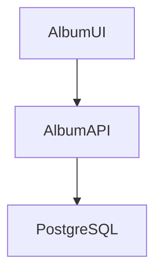

# Album API (Java)

Album UI と連携して利用するバックエンドのサービス。



#　ローカル環境
## ビルド

データベースサーバにはデフォルトでは h2 が利用されるが、Postgresql も利用可能。
`spring.profiles.active=postgresql` とすることで、Postgresqlに接続するようになる。
`src/main/resources/applications.properties` を編集するか、実行時のオプションでプロファイルを切り替える。

```
mvn package
```

## 実行

h2 データベースを利用する場合は

```
mvn spring-boot:run
```

Postresql を利用する場合は、コンテナでPostgresqlを実行後、アプリケーションを起動する。
```
podman compose --file docker-compose.yaml up postgres
mvn spring-boot:run
```

# ローカルコンテナ環境

## マルチステージビルド
```
podman build . -f docker/Dockerfile -v $HOME/.m2:/home/default/.m2 -t albumapi-java 
```
※ ビルドするプラットフォームと実行するプラットフォームが異なる場合は `--platform linux/amd64` などのオプションをつける
※ Manveの依存ライブラリダウンロードを毎回実行するのを避けるため、ローカルの .m2 ディレクトリをマウントするため `-v $HOME/.m2:/home/default/.m2` オプションをつけている。

## ビルド
ローカルでビルドして、その成果物をコンテナにする場合
```
mvn package
podman build . -f Dockerfile.runtime -t albumapi-java
```
※ ビルドするプラットフォームと実行するプラットフォームが異なる場合は `--platform linux/amd64` などのオプションをつける

## 実行
```
podman run -p 8080:8080 albumapi-java
```


# OpenShift環境

## s2i ビルドの利用　（Gitリポジトリを指定したビルド）

oc new-app registry.redhat.io/ubi9/openjdk-17:latest~https://github.com/akubicharm/containerapps-albumapi-java \
--strategy=source \
--name albumapi \
--context-dir=. \
--dry-run -o yaml > app-s2i.yaml

## バイナリビルドの利用 (JAR ファイルを指定したビルド)

## イメージビルドの利用(コンテナイメージを指定したビルド)


## マニフェストの作成

### oc コマンドの利用

前提条件：OpenShiftのAPIにアクセスしてログインしていること。
ログインしているクラスタやユーザがわからない場合は `oc config current-context` を実行。

* s2i ビルドの機能を使ったマニフェストの作成
```
oc new-app registry.redhat.io/ubi9/openjdk-17:latest~https://github.com/akubicharm/containerapps-albumapi-java \
--name albumapi \
--context-dir=. \
--dry-run -o yaml > app-s2i.yaml
```

* イメージビルドの機能を使ったマニフェストの作成
```
oc new-app --image=quay.io/keomizo_redhat/albumapi-java \
--name albumapi \
--dry-run -o yaml > app-img.yaml
```

上記コマンドでは、外部にURLで公開するためのRouteは作成されないので、アプリケーションデプロイ後に
`oc expose svc albumapi --dry-run -o yaml > app-route.yaml` を実行してYAMLファイルを作成できる。


### kubectl コマンドの利用


# Original Contents ... Azure Container Apps Album API

This is the companion repository for the [Azure Container Apps code-to-cloud quickstart](https://docs.microsoft.com/en-us/azure/container-apps/quickstart-code-to-cloud?tabs=bash%2Cjava&pivots=acr-remote).

This backend Album API sample is available in other languages:

| [C#](https://github.com/azure-samples/containerapps-albumapi-csharp) | [JavaScript](https://github.com/azure-samples/containerapps-albumapi-javascript) | [Go](https://github.com/azure-samples/containerapps-albumapi-go) | [Python](https://github.com/azure-samples/containerapps-albumapi-python) |
| -------------------------------------------------------------------- | -------------------------------------------------------------------------------- | ---------------------------------------------------------------- | ------------------------------------------------------------------------ |
