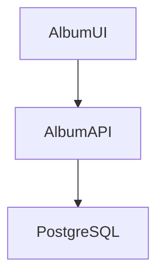

# Album API (Java)

Album UI と連携して利用するバックエンドのサービス。



#　ローカル環境
## ビルド

データベースサーバには h2 か Postgresql が利用可能。

`spring.profiles.active=postgresql` とすることで、Postgresqlに接続するようになる。
`src/main/resources/applications.properties` を編集するか、実行時のオプションでプロファイルを切り替える。

```
mvn package
```

## 実行

h2 データベースを利用する場合は

```
mvn spring-boot:run
```

Postresql を利用する場合は、コンテナでPostgresqlを実行後、アプリケーションを起動する。
```
podman compose --file docker-compose.yaml up postgres
mvn spring-boot:run
```


# OpenShift環境

## s2i ビルドの利用

## バイナリビルドの利用

## イメージビルドの利用


# Original Contents ... Azure Container Apps Album API

This is the companion repository for the [Azure Container Apps code-to-cloud quickstart](https://docs.microsoft.com/en-us/azure/container-apps/quickstart-code-to-cloud?tabs=bash%2Cjava&pivots=acr-remote).

This backend Album API sample is available in other languages:

| [C#](https://github.com/azure-samples/containerapps-albumapi-csharp) | [JavaScript](https://github.com/azure-samples/containerapps-albumapi-javascript) | [Go](https://github.com/azure-samples/containerapps-albumapi-go) | [Python](https://github.com/azure-samples/containerapps-albumapi-python) |
| -------------------------------------------------------------------- | -------------------------------------------------------------------------------- | ---------------------------------------------------------------- | ------------------------------------------------------------------------ |
